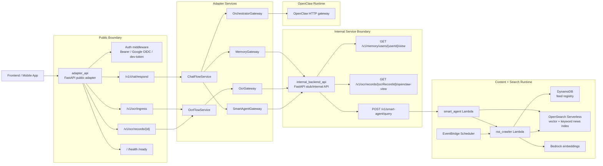
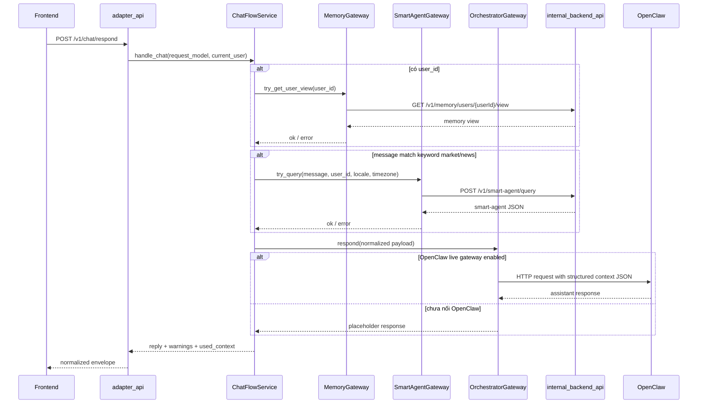
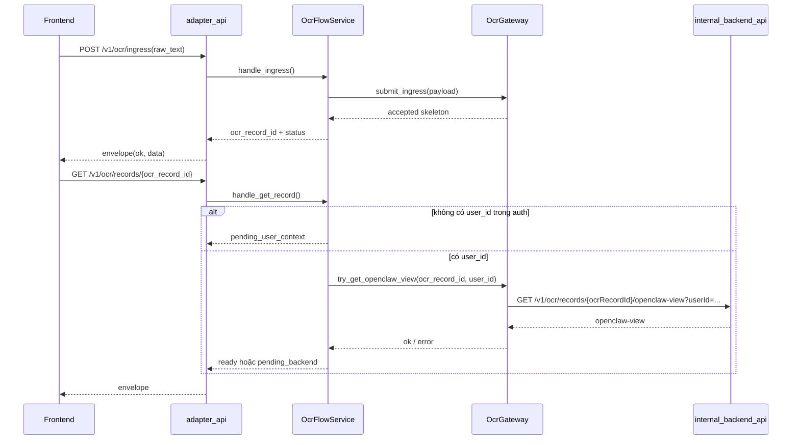
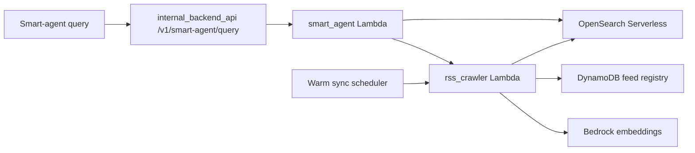

# GoalWealth Backend Architecture

Tài liệu này được vẽ lại trực tiếp từ code trong `goalwealth/` hiện tại, không dựa trên giả định ngoài repo.

## 1. Backend tổng thể

## 2. Boundary thực tế trong code

### Public boundary
- File: [goalwealth/src/adapter_api/app.py](/home/lossrunner/Documents/work/GoalWealth/goalwealth/src/adapter_api/app.py)
- Đây là API mà frontend nên gọi.
- Nó mount:
  - `health`
  - `chat`
  - `ocr`
  - `internal`

### Internal boundary
- File: [goalwealth/src/internal_backend_api/app.py](/home/lossrunner/Documents/work/GoalWealth/goalwealth/src/internal_backend_api/app.py)
- Đây là API nội bộ cho adapter/orchestrator gọi.
- Hiện tại là stub practical service để test end-to-end.

### Contract-first layer
- Public contract:
  - [goalwealth/contracts/api/goalwealth-adapter-public-api.openapi.yaml](/home/lossrunner/Documents/work/GoalWealth/goalwealth/contracts/api/goalwealth-adapter-public-api.openapi.yaml)
- Internal contract:
  - [goalwealth/contracts/api/openclaw-backend-api.openapi.yaml](/home/lossrunner/Documents/work/GoalWealth/goalwealth/contracts/api/openclaw-backend-api.openapi.yaml)
- Memory schema:
  - [goalwealth/contracts/memory/memory-service-view.schema.json](/home/lossrunner/Documents/work/GoalWealth/goalwealth/contracts/memory/memory-service-view.schema.json)

## 3. Public adapter bên trong hoạt động ra sao

### Service container
- File: [goalwealth/src/adapter_api/dependencies.py](/home/lossrunner/Documents/work/GoalWealth/goalwealth/src/adapter_api/dependencies.py)
- `ServiceContainer` hiện gồm:
  - `auth_service`
  - `orchestrator_gateway`
  - `memory_gateway`
  - `ocr_gateway`
  - `smart_agent_gateway`
  - `chat_flow_service`
  - `ocr_flow_service`

### Auth
- File: [goalwealth/src/adapter_api/services/auth_service.py](/home/lossrunner/Documents/work/GoalWealth/goalwealth/src/adapter_api/services/auth_service.py)
- Hỗ trợ:
  - Google OIDC bearer
  - `dev-token:<user_id>` khi bật dev mode

### Router mỏng, logic nằm ở flow service
- Chat router:
  - [goalwealth/src/adapter_api/routers/chat.py](/home/lossrunner/Documents/work/GoalWealth/goalwealth/src/adapter_api/routers/chat.py)
- OCR router:
  - [goalwealth/src/adapter_api/routers/ocr.py](/home/lossrunner/Documents/work/GoalWealth/goalwealth/src/adapter_api/routers/ocr.py)

## 4. Chat flow

### Chat flow thực tế trong code
- File: [goalwealth/src/adapter_api/services/chat_flow_service.py](/home/lossrunner/Documents/work/GoalWealth/goalwealth/src/adapter_api/services/chat_flow_service.py)
- Trình tự:
  1. lấy `user_id` từ auth context
  2. best-effort load `memory_context`
  3. nếu message có keyword thị trường/news thì gọi `smart_agent`
  4. build normalized payload
  5. gửi qua `OrchestratorGateway`

### Điểm quan trọng
- Nếu memory/smart-agent fail:
  - không làm chết request
  - warning sẽ được trả ra ngoài
- Đây là soft-degradation có chủ đích.

## 5. OCR flow

### OCR flow thực tế trong code
- File: [goalwealth/src/adapter_api/services/ocr_flow_service.py](/home/lossrunner/Documents/work/GoalWealth/goalwealth/src/adapter_api/services/ocr_flow_service.py)
- `POST /v1/ocr/ingress` hiện chỉ là skeleton acceptor.
- `GET /v1/ocr/records/{id}` mới là chỗ adapter lấy `openclaw-view`.

### Trạng thái OCR public hiện tại
- `pending_user_context`
- `pending_backend`
- `ready`

## 6. Internal backend API hiện đang làm gì

### Entry
- File: [goalwealth/src/internal_backend_api/routes.py](/home/lossrunner/Documents/work/GoalWealth/goalwealth/src/internal_backend_api/routes.py)

### Current endpoints
- `GET /v1/memory/users/{userId}/view`
- `GET /v1/ocr/records/{ocrRecordId}/openclaw-view`
- `POST /v1/smart-agent/query`

### Vai trò
- Đây là lớp giả lập hợp đồng nội bộ để:
  - adapter test được end-to-end
  - orchestrator client code có target thật để gọi
  - chưa cần domain service production đầy đủ

## 7. Smart Agent + News retrieval

### RSS crawler
- File: [goalwealth/src/lambdas/rss_crawler/handler.py](/home/lossrunner/Documents/work/GoalWealth/goalwealth/src/lambdas/rss_crawler/handler.py)
- Vai trò:
  - load feed registry từ DynamoDB
  - fetch RSS
  - normalize/dedupe content
  - embed text qua Bedrock
  - upsert article vào OpenSearch Serverless

### Smart agent lambda
- File: [goalwealth/src/lambdas/smart_agent/handler.py](/home/lossrunner/Documents/work/GoalWealth/goalwealth/src/lambdas/smart_agent/handler.py)
- Vai trò:
  - classify route:
    - `fresh_news`
    - `semantic_search`
    - `hybrid_search`
  - query OpenSearch
  - có thể trigger refresh qua crawler khi freshness thấp

## 8. Deployment/runtime view

### Hạ tầng chính
- File: [goalwealth/infra/sam/template.yaml](/home/lossrunner/Documents/work/GoalWealth/goalwealth/infra/sam/template.yaml)

### Thành phần chính trong SAM
- DynamoDB:
  - `FeedRegistryTable`
- OpenSearch Serverless:
  - `NewsSearchCollection`
- Lambda:
  - `RssCrawlerFunction`
  - `SmartAgent...` resources
- Scheduler:
  - warm sync event cho crawler

## 9. Kiến trúc backend hiện tại nên hiểu như thế nào

### Cách hiểu đúng
- `adapter_api` là public API layer
- `internal_backend_api` là internal contract/stub layer
- `OpenClaw` là orchestration runtime phía sau adapter
- `smart_agent Lambda + rss_crawler Lambda` là content intelligence/search subsystem

### Cái gì đang là thật
- boundary
- contracts
- request envelope
- auth middleware
- gateway/service split
- smart-agent + crawler infra direction

### Cái gì đang là bridge hoặc stub
- internal backend hiện vẫn là practical stub service
- OCR ingress chưa đẩy xuống normalization backend thật
- Orchestrator có fallback placeholder nếu OpenClaw chưa live

## 10. Kết luận ngắn

Nếu vẽ ngắn gọn nhất, backend GoalWealth hiện tại là:

1. `Frontend` chỉ gọi `adapter_api`
2. `adapter_api` chịu auth + envelope + assembling context
3. `adapter_api` gọi:
   - `internal_backend_api` để lấy memory/OCR/smart-agent data
   - `OpenClaw` để tạo câu trả lời cuối
4. `internal_backend_api` hiện đang đứng trên các stub/service nội bộ
5. `smart_agent + rss_crawler + OpenSearch + DynamoDB + Bedrock` tạo thành news/search pipeline riêng

Nếu cần, bước tiếp theo hợp lý là:
- mình vẽ tiếp một bản **component diagram chi tiết hơn theo file/class**
- hoặc tạo luôn một **sequence diagram riêng cho sign-in + OCR + chat** để dùng trong docs kỹ thuật
